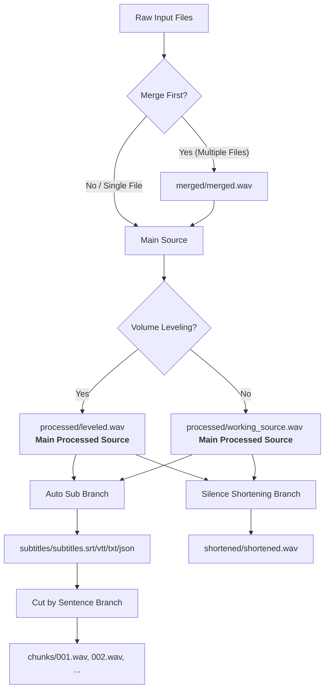

# Audio Factory Pipeline Specification

This document defines the expected behaviors, directory structures, and processing pipelines for the Audio Factory backend.

## 1. Output Folder Behavior

- **Base Folder**: The user selects a base output folder (e.g., `D:\Output`).
- **Project Folder**: The app MUST create a dedicated project folder inside the selected base folder. Files must never be dumped directly into the base folder.
- **Naming Rules**:
  - If `project_name` is provided, use it as the project folder name (after sanitizing special characters).
  - If `project_name` is empty or not provided, generate a folder name using the input filename and a timestamp: `<input_filename>_YYYYMMDD_HHMMSS`.
- **Overwrite Safety**:
  - If the target project folder already exists:
    - If `overwrite` is disabled (default), append an incremental suffix (e.g., `_01`, `_02`) to the project folder name to avoid overwriting existing data.
    - If `overwrite` is explicitly enabled, reuse the folder and overwrite the matching files inside.

## 2. Merge Behavior

Merge is an input-shaping step that occurs before any downstream processing:
- **Multiple Inputs + Merge ON**:
  - Combine all input files into a single merged audio source (`merged/merged.wav`).
  - Run the rest of the pipeline (leveling, silence shortening, transcription, etc.) on this single merged source as one unified project.
- **Multiple Inputs + Merge OFF**:
  - Fall back to **Batch Mode**.
  - Process each input file individually in its own separate project folder under the base output folder.
- **Single Input + Merge ON**:
  - Skip the merge step safely.
  - Log a warning/info message: `"Merge requested but only one input file provided. Skipping merge step safely."`
  - Continue processing the single file.

## 3. Auto Sub Behavior

Auto Sub generates offline transcriptions and formats them into multiple subtitle outputs.
- **Source**: It always runs on the **Main Processed Source** (see Section 6).
- **Outputs**:
  - `subtitles/subtitles.srt`
  - `subtitles/subtitles.vtt`
  - `subtitles/subtitles.txt`
  - `subtitles/subtitles.json`

## 4. Cut by Sentence Behavior

Slices the audio into sentence-based chunks using transcription sentence timestamps.
- **Dependency**: Can only be enabled if **Auto Sub** is enabled.
- **Source**: Chunks are cut from the **Main Processed Source** (NOT from the silence-shortened file).
- **Outputs**:
  - `chunks/001.wav`
  - `chunks/002.wav`
  - `chunks/003.wav`
  - (Format matches selected output format: `.wav`, `.mp3`, etc.)

## 5. Silence Shortening Behavior

Shortens silent intervals in the audio to produce a more compact track.
- **Output Branch**: Creates a separate, full-length shortened output file.
- **Source**: Processes the **Main Processed Source**.
- **Outputs**:
  - `shortened/shortened.wav` (or appropriate format extension).
- **Independence**:
  - It does NOT affect subtitle timestamps.
  - It does NOT affect sentence chunk timestamps.
  - Do NOT trim silence inside individual sentence chunks (no `chunks_trimmed` directory in MVP).

## 6. Pipeline Source Flow & Branching

The **Main Processed Source** is defined as:
1. `processed/leveled.wav` (if volume leveling is enabled).
2. Otherwise, the standardized WAV working copy of the input file (`processed/working_source.wav`), or the merged file (`merged/merged.wav`) if merging was performed.

When **Auto Sub**, **Cut by Sentence**, and **Silence Shortening** are all enabled, they fork from the **Main Processed Source** into separate, parallel branches:



## 7. Recommended Directory Structure

A complete project folder has the following layout. Only subdirectories corresponding to enabled pipeline steps are created (except `metadata`, which is always created):

```
project_folder/
├── input/         (optional: symlinks/copies of original inputs)
├── merged/        (created if Merge ON & multiple files)
│   └── merged.wav
├── processed/     (created if Volume Leveling ON or default copy is made)
│   ├── leveled.wav
│   └── working_source.wav
├── subtitles/     (created if Auto Sub ON)
│   ├── subtitles.srt
│   ├── subtitles.vtt
│   ├── subtitles.txt
│   └── subtitles.json
├── chunks/        (created if Cut by Sentence ON)
│   ├── 001.wav
│   └── 002.wav
├── shortened/     (created if Silence Shortening ON)
│   └── shortened.wav
└── metadata/      (always created)
    └── project_metadata.json
```
